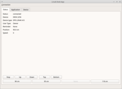
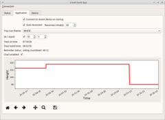
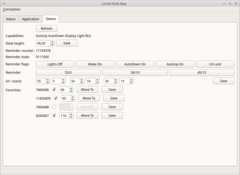

# Linak Desk Application
This is desktop application controlling Linak office desks. Application functionality is 
similar to application provided by Linak. 
One of the goals of this project is to allow the desk control under Linux operating 
systems, because official application does not support Linux OS. 

Application was tested on *DPG1C* desk panel containing built-in Bluetooth module.

Communication protocol between *DPG1C* module and official application was
reverse engineered mostly by mocking *DPG1C* Bluetooth service.

## Features
- scanning for nearby devices
- moving up/down
- moving to favourite position
- setting reminder, desk offset and favoritie positions
- system tray icon
- persisting application settings
- drawing position chart over time
- position statistics

## Screens

## Modules
- linakdeskapp.main -- entry point for the application
- linakdeskmock -- Bluetooth service mocking Linak desk service
- testlinakdeskapp -- unit tests for the application

## Running application

To run application try one of:
- run *src/linakdeskctl*
- run *src/linakdeskapp/main.py* 
- execute *cd src; python3 -m linakdeskapp*

Application can be run in profiler mode passing *--profile* as command line parameter. 

### Running mock service

To run mock simply execute *linakdeskmock/main.py* file.

### Running tests

To run tests execute *src/runtests.py*. It can be run with code profiling 
and code coverage options.

In addition there is demo application not requiring Bluetooth connection. It 
can be run by *testlinakdeskapp/gui/main_window_example.py*.

## Required libraries
- PyQt5
- matplotlib
- pandas
- bluepy

## Examples of use of not obvious Python mechanisms:
- use of *EnumMeta* class (*linak_service.py*)
- defining method decorators (*synchronied.py*)
- use of threading: *Thread*, *Event*, *Timer*
- use of *QThreadPool* and *Worker* concepts
- properly killing (Ctrl+C) PyQt (*sigint.py*)
- loading of UI files and inheriting from it
- embedding matplotlib graph with navigation toolbar into PyQt widget
- code profiling (*cProfile*)
- code coverage (*coverage*)

## ToDo:
- handle cm/inch unit switch
- add fav buttons inside popup of system tray icon
- handle away from keyboard

## Issues:
- disabling light guidance does not seem to work. It seems to be problem on 
device side, because even in Linak app it does not work.

## Development
If You are willing to work on this project, then after first clone You have to fetch submodule inside *lib*.
To do this simply call *configure_submodules.sh* script placed in root directory tree.

## References:
- https://www.linak.com/products/controls/dpg-with-reminder/
- https://www.linak.com/products/controls/desk-control-apps/
- https://ianharvey.github.io/bluepy-doc/index.html
- https://github.com/Vudentz/BlueZ/tree/master/doc

