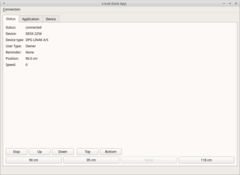
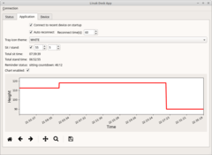
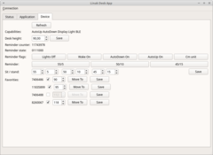
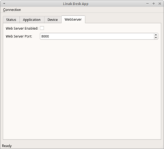

# Linak Desk Application
This is desktop application controlling Linak office desks. Application functionality is 
similar to application provided by Linak. 
One of the goals of this project is to allow the desk control under Linux operating 
systems, because official application does not support Linux OS. 

Application was tested on *DPG1C* desk panel containing built-in Bluetooth module.

Communication protocol between *DPG1C* module and official application was
reverse engineered mostly by mocking *DPG1C* Bluetooth service.

## Features
- scanning for nearby devices
- moving up/down
- moving to favourite position
- setting reminder, desk offset and favoritie positions
- system tray icon
- auto reconnecting to recent device
- persisting application settings
- drawing position chart over time
- position statistics

## Screens

## Installation

Installation of package can be done by:
  - to install package from downloaded ZIP file execute: `pip3 install --user -I file:LinakDeskApp-master.zip`
  - to install package directly from GitHub execute: `pip3 install --user -I git+https://github.com/anetczuk/LinakDeskApp.git`
  - installation from local repository root directory: `pip3 install --user .`

To uninstall run: `pip3 uninstall linakdeskapp`

Installation for development:
  - `python3 -m venv .venv`
  - `source .venv/bin/activate`
  - `python -m pip install --upgrade pip`
  - `python -m pip install -e '.[dev]'` to install runtime and development dependencies from `pyproject.toml`
  - `src/install-deps.sh` to install runtime dependencies declared in `pyproject.toml`
  - `src/install-package.sh` to install the package from the repository root through `pip`
  - `src/install-devel.sh` to install the package in editable mode and install development tooling

## Requirements

Before first run there is few things to configure. All steps can be run by calling 
`configure_all.sh` script.

If the script fails for any reason then go through steps described in subsections below.

### Required libraries

- PyQt5
- matplotlib
- pandas
- bluepy

Following depndencies can be installed by running script `./src/install-deps.sh` or directly by 
`python -m pip install .`.

### System requirements

Python dependencies are managed through `pyproject.toml`, but the application still needs native Linux packages for
building `bluepy` and loading the Qt platform plugins at runtime.

Required system packages:

- Python 3.12
- `git`, `gcc`, `make`, `pkg-config`
- GLib and D-Bus development/runtime libraries
- OpenGL libraries
- Font and FreeType libraries
- X11/XCB libraries used by the Qt `xcb` platform plugin
- Wayland client libraries
- `zlib`

On Debian or Ubuntu the package list is roughly:

`python3.12 python3.12-venv git build-essential pkg-config libglib2.0-dev libdbus-1-dev libgl1 libfontconfig1 libfreetype6 libx11-6 libx11-xcb1 libxext6 libxrender1 libxcb1 libxcb-icccm4 libxcb-image0 libxcb-keysyms1 libxcb-randr0 libxcb-render0 libxcb-render-util0 libxcb-shape0 libxcb-shm0 libxcb-sync1 libxcb-xfixes0 libxcb-xinerama0 libxcb-xkb1 libxcb-util1 libxcb-ewmh2 libxkbcommon0 libxkbcommon-x11-0 libwayland-client0 zlib1g`

Package names vary by distribution, so use the list above as the dependency checklist rather than assuming exact names.

### Bluepy permissions

*Bluepy* package requires special privileges when scanning for nearby devices.
It is recomended to solve it by adding capabilities to the package:

`cd <PYTHON_PATH>/site-packages/bluepy`

`sudo setcap 'cap_net_raw,cap_net_admin+eip' bluepy-helper`

Go to directory where bluepy is installed (local user or system) and execute `setcap` as stated above.

This setting can be also done by executing script `./src/configure_bluepy.sh`.

### Git submodules

In addition, application requires additional submodule located in *lib* directory.
To fetch the module simply call *configure_submodules.sh* script placed in root directory tree.

## Running application

To run application try one of:
- run *src/linakdeskctl*
- run *src/linakdeskapp/main.py* 
- execute *cd src; python3 -m linakdeskapp*
- execute *python3 -m linakdeskapp* (when installed)

Before first use make sure You have fetched *lib* submodule (see _Requirements_ section).

### Web server

Desk position can be operated through http GET requests. Before sending a requests 
the web server have to be started. It can be done by activating chekcbox from `WebServer`. 
Then `http://localhost:8000` will be accessible from web browser. Visit the web page for possible commands.

## Development

Project contains several tools and features that facilitate development and maintenance of the project.

The recommended development workflow is based on `pip`, virtual environments and `pyproject.toml`.

- `python3 -m venv .venv`
- `source .venv/bin/activate`
- `python -m pip install --upgrade pip`
- `python -m pip install -e '.[dev]'` installs the application, runtime dependencies and development tooling into `.venv`
- `python src/testlinakdeskapp/runtests.py` runs the test suite
- `pycodestyle --show-source --statistics --count --ignore=E115,E126,E201,E202,E221,E241,E262,E265,E266,E402,E501,W391,D src`
- `flake8 --show-source --statistics --count --ignore=E115,E126,E201,E202,E221,E241,E262,E265,E266,E402,E501,W391,D,F401 src`
- `pydocstyle --count --convention=numpy --add-ignore=D100,D101,D102,D103,D104,D105,D107 src`
- `./process-all.sh` creates or reuses `.venv`, installs `.[dev]`, then runs the same test and lint flow

In case of pull requests please run `process-all.sh` before the request.

### Static code check

In *tools* directory there can be found following legacy helper scripts:
- *notrailingwhitespaces.sh* -- as name states removes trailing whitespaces from _*.py*_ files
- *rmpyc.sh* -- remove all _*.pyc_ files
- *codecheck.sh* -- static code check using *pycodestyle* and *flake8* against defined set of rules
- *doccheck.sh* -- run *pydocstyle* with defined configuration
- *checkall.sh* -- execute *codecheck.sh* and *doccheck.sh* at once

They are kept for older local workflows, but the preferred commands are the plain `pip` and `.venv` variants listed above.

### Profiling

Application can be run in profiler mode passing *--profile* as command line parameter. 

### Running tests

To run tests execute *src/testlinakdeskapp/runtests.py*. It can be run with code profiling 
and code coverage options.

In addition there is demo application not requiring Bluetooth connection. It 
can be run by *testlinakdeskapp/gui/main_window_example.py*.

### Running mock service

To some extent there is possibility to test the application without physical device. *linakdeskmock* package was made
for this purpose.

To run mock simply execute *linakdeskmock/main.py* file.

### Analysing Bluetooth device

Directory *test/gatttool* contains several scripts providing information about near devices such as:
- near LE devices,
- services, characteristics and descriptors of desired device,
- basic characteristics of desired device (name, manufacturer, version etc),
- listening to desk notifications

### Reversing communication protocol

Some of dynamic properties of communication protocol of the desk was 
discovered by dedicated tool: [BluetoothGattMitm](https://github.com/anetczuk/BluetoothGattMitm).

The tool allows to intercept all BLE messages passed between the device and it's original Android application.

### Working with venv

Use standard Python tooling to manage the local virtual environment:

- `python3 -m venv .venv`
- `source .venv/bin/activate`
- `python -m pip install -e '.[dev]'`

The scripts in `tools/` are legacy wrappers and are no longer required for the normal development flow.

In addition following package is required (installed from within venv):
- `pip3 install --user vext.pyqt5`

Moreover for unknown reason fixing *bluepy* permissions inside virtual environment can be ineffective leading
to problems with scanning for nearby bluetooth devices.

This problem can solved by one of two workarounds:
1. executing application with `sudo` (not recomended)
2. passing device's address by command-line argument `./src/linakdeskctl --connect {device_mac_address}`

## Examples of use of not obvious Python mechanisms:
- use of *EnumMeta* class (*linak_service.py*)
- defining method decorators (*synchronied.py*)
- use of threading: *Thread*, *Event*, *Timer*
- use of *QThreadPool* and *Worker* concepts
- properly killing (Ctrl+C) PyQt (*sigint.py*)
- loading of UI files and inheriting from it
- embedding matplotlib graph with navigation toolbar into PyQt widget
- code profiling (*cProfile*)
- code coverage (*coverage*)

## ToDo:
- handle cm/inch unit switch
- add fav buttons inside popup of system tray icon
- handle away from keyboard

## Issues:
- disabling light guidance does not seem to work. It seems to be problem on 
device side, because even in Linak app it does not work.

## Support

If You like the project or if it is valuable to You then feel free to support my work.

## References:
- https://www.linak.com/products/controls/dpg-with-reminder/
- https://www.linak.com/products/controls/desk-control-apps/
- https://ianharvey.github.io/bluepy-doc/index.html
- https://github.com/Vudentz/BlueZ/tree/master/doc
